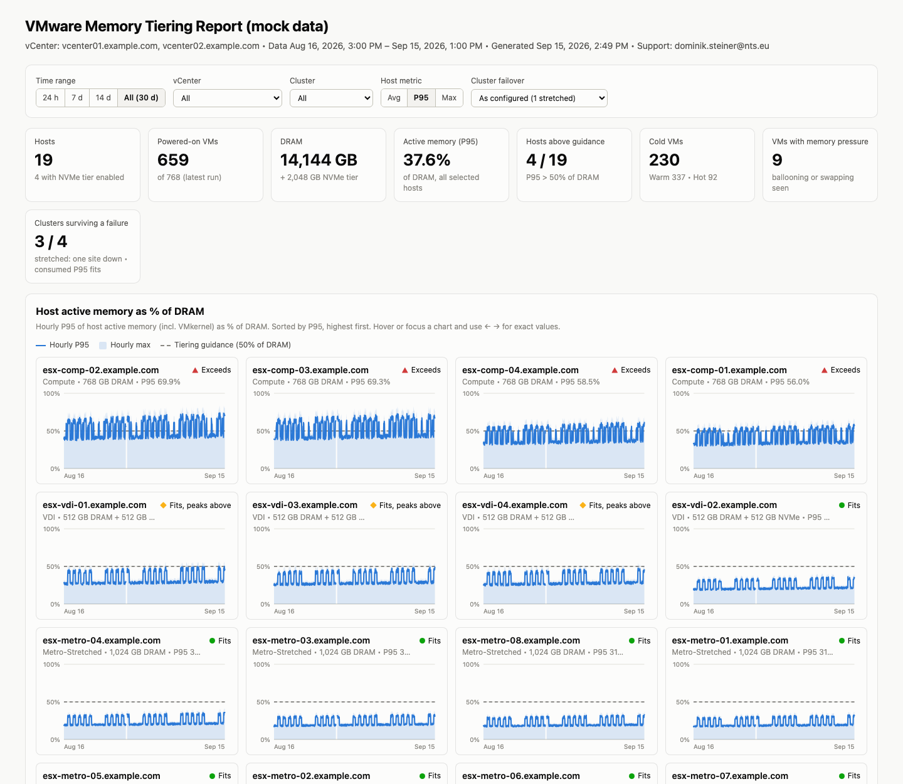
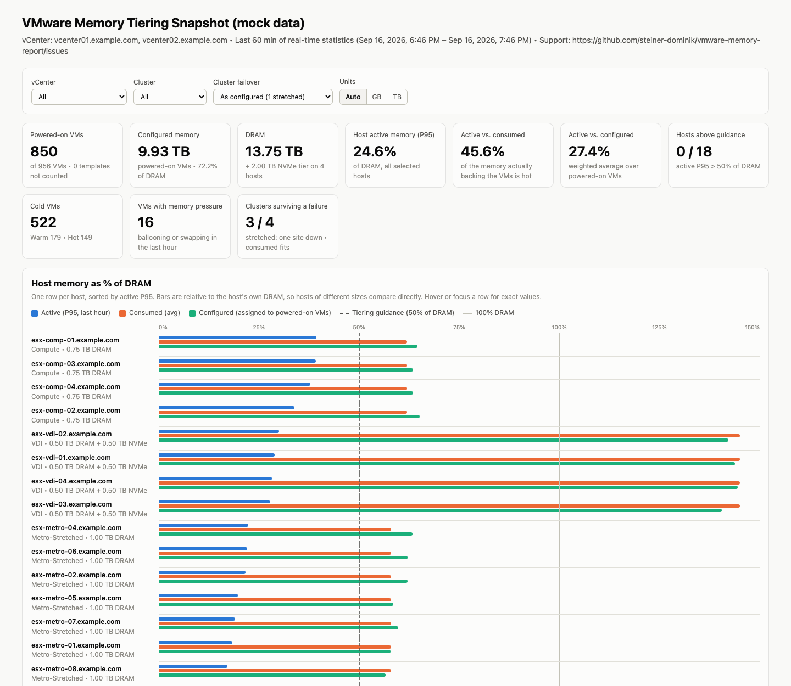
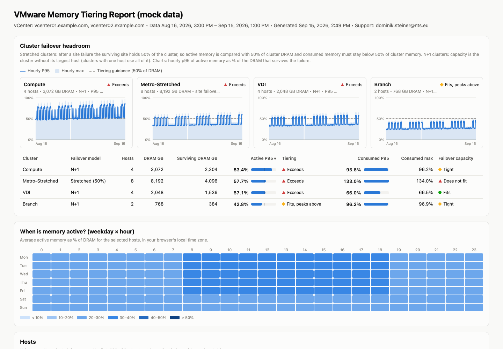

# vmware-memory-report

**Find out whether NVMe memory tiering can cut your VMware memory bill, based on weeks of real data instead of a guess.**



<sub>All screenshots and example reports use mock data. Open [`examples/mock-trend-report.html`](examples/mock-trend-report.html) or [`examples/mock-snapshot-report.html`](examples/mock-snapshot-report.html) to click through a report.</sub>

> **Disclaimer:** This is an independent community project. It is not affiliated with, endorsed by or supported by VMware or Broadcom. Use at your own risk.

## 💸 Memory is unacceptably expensive?

* DRAM is often the biggest line item in a new ESXi host, and prices keep rising.
* Most VMs keep a lot of memory they rarely touch.
* You pay DRAM prices for memory that just sits there.

## 🚀 Memory tiering can help

* **NVMe memory tiering** (vSphere 8.0 U3 / VCF 9) moves cold memory pages to fast NVMe drives.
* Hot pages stay in DRAM. With the default 1:1 ratio, a host can offer up to twice its DRAM.
* The catch: it only works if your **active** memory fits into DRAM. Broadcom's guidance is to keep active memory at or below **50% of DRAM**.

## 📐 The one metric that decides it: active vs. consumed

**Consumed** is the memory your hosts really back the VMs with. **Active** is the part of it the guests actually touch. Everything in between is cold — and cold memory is exactly what an NVMe tier moves out of DRAM.

> If active memory is at or below **40% of consumed memory**, the cluster is a tiering candidate.

Active memory as a share of **DRAM** answers a different question. A host at 12% active of DRAM may simply be empty; that says nothing about how much cold memory there is to move. Active/DRAM is the **feasibility** check (does the hot set still fit after you take DRAM away?), active/consumed is the **benefit** check. This report leads with the benefit and keeps the feasibility check next to it.

The two cases where that pays off:

| | Question | What the report gives you |
|---|---|---|
| 🛒 **Buying new hardware** | How little DRAM do I need? | `DRAM needed`, `DRAM saved` per cluster |
| 🧱 **Extending what you own** | CPU is fine, RAM is full — how much more fits? | `Capacity with a tier`, `Extra memory` per cluster |

## 🔍 But will it work for *your* clusters?

A single look at vCenter won't tell you. Active memory swings with backups, batch jobs and month-end. This project measures it **every 15, 30 or 60 minutes, for weeks**, and answers:

* **Which clusters are good candidates?** Ranked by active vs. consumed memory.
* **How much would you save?** DRAM you would not buy again, and extra memory a tier would free up.
* **Does the hot set still fit DRAM?** The 50% feasibility check, per host and per cluster.
* **Does it still fit after a failure?** Checked for N+1 and for stretched clusters (a whole site down).
* **What about hosts that already have a tier?** Cold memory sitting on NVMe is *not* counted as a saving again — see the arithmetic below.
* **Which VMs are oversized?** Worst-day active vs. configured memory per VM.

## ✨ What you get

* 📊 **One HTML report**, self-contained, works offline, light and dark mode.
* 🔄 **Always up to date:** the report is rebuilt after every run and overwrites the previous one. No history is lost, the raw data stays in CSV files.
* 🎯 **Real numbers:** every 20-second sample of each window is read and reduced to average, P95 and max. No single-sample guesswork.
* ⏱️ **Your cadence:** collect every 60, 30 or 15 minutes. Shorter intervals give a finer time resolution and lose less data when a run fails.
* 🏢 **Stretched cluster aware:** site failover (50% capacity) next to classic N+1.
* 🔒 **Read-only:** a read-only vCenter account is all it needs. Nothing is changed in vCenter.
* 🧰 **Two editions, same result:** PowerShell (PowerCLI) or Python (no extra packages). Both write the same CSV files and build the same report.
* 🏠 **Easy install for the homelab:** a Home Assistant app or a Docker container runs the Python edition on schedule and serves the report, no cron or scheduled task needed.
* 🌍 **English and German**, switchable in the report and in the panel.
* ⚡ **Quick snapshot:** want a first impression right now? The snapshot script looks at the last hour, no scheduling needed.

## ✅ Supported environments

| | Supported | Tested |
|---|---|---|
| **vCenter** | 8.0 U1 or later (Python edition needs the VI/JSON API from 8.0 U1) | 8.0 U3, 9.1 |
| **ESXi / memory tiering** | NVMe tier sizes are read on 8.0 U3 or later; older hosts are reported with DRAM only | 8.0 U3, 9.1 |
| **PowerShell** | Windows PowerShell 5.1 or PowerShell 7.x, with PowerCLI 13.x or later (VCF.PowerCLI) | PowerShell 7.x |
| **Python** | 3.6 or later, standard library only | Python shipped with vCenter 8.0 U3 / 9.1, Python 3.14 |
| **Operating system** | Windows (scheduled task installer), Linux (cron setup), macOS for manual runs | Linux (Photon OS), macOS |

Not tested yet: Windows PowerShell 5.1, the Windows scheduled task installer, and hosts that already have memory tiering enabled (mock data only). Sub-hourly collection is implemented and unit-tested but has not run against a production vCenter yet.

## 🖥️ Where should it run?

* ✅ **Recommended:** a Windows jump host, a management server or a small Linux VM that can reach vCenter on port 443.
* 🏠 **Homelab:** your Home Assistant install or any Docker host that can reach vCenter, see [Home Assistant app and Docker](#-home-assistant-app-and-docker).
* ⛔ **Not recommended:** the vCenter Server Appliance itself. It would technically work (Python 3 is on the appliance), but custom scripts and cron jobs on the appliance are not supported by Broadcom, and the data is gone after the next major upgrade.

## ⏱️ Try it in one minute (no vCenter needed)

```bash
python3 examples/generate-mock-data.py examples/mock-data
python3 python/memtier.py report --config examples/mock.ini --output mock-report.html
```

Then open `mock-report.html` in your browser.

## 🪟 Setup on Windows (PowerShell)

1. Copy the `powershell` and `template` folders side by side, e.g. to `D:\MemTier\scripts\`.
2. Open an **elevated** PowerShell **as the account that will run the task**, for example:
   ```powershell
   runas /user:DOMAIN\svc-memtier powershell.exe
   ```
3. Run the installer:
   ```powershell
   .\Install-MemTierTasks.ps1 -VCenterServer vcenter01.example.com -BaseDir D:\MemTier -CompressOldMonths
   ```
   * Saves the vCenter credential encrypted for this account only
   * Tests the connection
   * Registers the scheduled task **MemTier Collector** (hourly; `-IntervalMinutes 30` or `15` for spikier workloads)
4. Start a first run and open the report:
   ```powershell
   Start-ScheduledTask -TaskName 'MemTier Collector'
   ```
   📄 `D:\MemTier\reports\MemTier_Report.html` (rebuilt after every run)

Stretched clusters? Add `-StretchedCluster` (all clusters) or `-StretchedClusterName Metro-A,Metro-B`.

## 🐧 Setup on Linux (Python)

1. Copy `python/memtier.py` and `template/memtier-report.template.html` into one folder, e.g. `/opt/memtier`.
2. Create the config, test the login and install the cron job (as root):
   ```bash
   python3 /opt/memtier/memtier.py setup --config /opt/memtier/memtier.ini --install-cron
   ```
   * Asks for the vCenter FQDN, a read-only user, its password and the collection interval
   * The config file is created with mode 600; leave the password empty to use the `MEMTIER_PASSWORD` environment variable instead
3. Start a first run:
   ```bash
   python3 /opt/memtier/memtier.py collect --config /opt/memtier/memtier.ini
   ```
   📄 `/opt/memtier/reports/MemTier_Report.html` (rebuilt after every run)

All settings (interval, stretched clusters, thresholds, language, retention, TLS) live in `memtier.ini`. For TLS verification, set `ca_file` to the vCenter root certificate ("Download trusted root CA certificates" on the vCenter start page).

## 🏠 Home Assistant app and Docker

The container runs the Python edition on the configured interval, rebuilds the report after every run and serves it together with a small status page (last collection per vCenter, run history, CSV downloads). Collection and report are identical to the scripts, and the CSV files in the data volume can be read by either edition.

**Home Assistant**

[](https://my.home-assistant.io/redirect/supervisor_add_addon_repository/?repository_url=https%3A%2F%2Fgithub.com%2Fsteiner-dominik%2Fhome-assistant-apps)

1. Add `https://github.com/steiner-dominik/home-assistant-apps` under **Settings → Apps → App Store → ⋮ → Repositories**.
2. Install **VMware Memory Tiering Report**, enter the vCenter FQDN, a read-only user and its password on the **Configuration** tab and start it.
3. Open **Memory Tiering** in the sidebar. The app also creates `sensor.memtier_status`, `sensor.memtier_active_of_consumed`, `sensor.memtier_cold_in_dram` and a few more entities.

**Docker**

```bash
curl -LO https://github.com/steiner-dominik/vmware-memory-report/releases/latest/download/compose.yaml
curl -L -o .env https://github.com/steiner-dominik/vmware-memory-report/releases/latest/download/env.example
docker compose up -d
```

Edit `.env` before starting it: `MEMTIER_SERVERS`, `MEMTIER_USERNAME`, `MEMTIER_PASSWORD` and, if the port is reachable from your network, `MEMTIER_UI_PASSWORD`. Then open `http://<docker-host>:8080`. Every option of `memtier.ini` has a `MEMTIER_*` variable, listed in `env.example`.

The image bundles the scripts too: `docker run --rm ghcr.io/steiner-dominik/vmware-memory-report cli --help`.

📦 The scripts are attached to every [release](https://github.com/steiner-dominik/vmware-memory-report/releases) as a zip, so you never need the container to use them.

## ⚡ Quick snapshot (last hour only)

```powershell
.\Get-MemTierSnapshot.ps1 -VCenterServer vcenter01.example.com
```

* Writes an HTML report plus Excel-ready CSV files for VMs and hosts
* Good for a first impression; for a decision, let the collector run for a few weeks



## 📖 Reading the report

* **Memory tiering candidates:** every cluster ranked by active vs. consumed memory, best first.
  * *Strong candidate* ≤ 20% · *Candidate* ≤ 40% · *Limited benefit* ≤ 60% · *Little benefit* above that
  * A second badge says whether the hot set still fits today's DRAM (*Hot set fits DRAM* / *DRAM-bound today*). That one only limits tiering on hosts you already own.
* **Sizing:** `DRAM needed`, `DRAM saved`, `Capacity with a tier` and `Extra memory` per cluster — the two buying decisions, with numbers.
* **Host charts:** active and consumed memory per host over time, with the 50% feasibility line.
* **Cluster failover headroom:** does active memory still fit after a host or site failure?
* **Weekday × hour heatmap:** batch windows and business hours at a glance.
* **Hosts and VMs tables:** searchable, sortable, exportable to CSV.
* **Collector runs:** gaps and failed runs are visible, nothing fails silently.
* **Language:** English and German, switchable in the report itself (the choice is remembered per browser).

## 🧮 The arithmetic, on one page

The report carries the same diagram under *How these numbers are calculated*.

```text
ONE HOST, ONE COLLECTION INTERVAL

  configured  |################################################################|  512 GB
              memory assigned to the powered-on VMs - includes memory never touched

  consumed    |##########################################|                        336 GB
              machine memory the host really backs the VMs with

  active      |############|                                                      101 GB
              guest pages recently touched - the hot working set

              |<- active ->|<----------- cold (consumed - active) ---->|
                    30 %                          70 %

              active / consumed = 101 / 336 = 30 %  ->  candidate (at or below 40 %)


BUYING NEW HARDWARE                      the same workload, sized with a 1:1 tier

  DRAM 384 GB                            DRAM 202 GB   +   NVMe 202 GB
  +-----------------------------+        +--------------+--------------+
  |active|        cold          |        |active| cold  |     cold     |
  +-----------------------------+        +--------------+--------------+
  336 GB of memory, all in DRAM          hot set 101 GB <= 50 % of 202 GB DRAM: fits

    DRAM needed = max( active P95 / 50 % , consumed peak / (1 + 1) )
                = max( 101 / 0.5 , 336 / 2 ) = max( 202 , 168 ) = 202 GB
    DRAM saved  = 384 - 202 = 182 GB


EXTENDING HOSTS YOU ALREADY OWN          no new DRAM, add NVMe instead

    capacity with a 1:1 tier = DRAM x (1 + 1) = 384 x 2 = 768 GB
    extra memory             = 768 - 336 (consumed peak) = 432 GB
    valid while active P95 stays at or below 50 % of the 384 GB DRAM


HOSTS THAT ALREADY HAVE A TIER           cold memory must not be counted twice

  DRAM 192 GB  +  NVMe 192 GB            consumed 336 GB, active 101 GB
  +--------------+--------------+
  |active| cold  |     cold     |          on NVMe     = consumed - DRAM        = 144 GB
  +--------------+--------------+          cold in DRAM = min(consumed, DRAM)
     101     91         144                             - active = 192 - 101    =  91 GB

    Only those 91 GB are still in DRAM and still movable. Reporting the full
    235 GB of cold memory would promise the same saving a second time.
```

**Hosts that already have a tier** are the case that is easy to get wrong: their consumed memory
legitimately exceeds their DRAM, and the part above DRAM is already on NVMe. Reporting all of
`consumed − active` as movable cold memory would count that saving twice, so the report caps it at
DRAM and shows what is already on NVMe in its own column.



## 🧩 Good to know

* **How data is collected:** ESXi keeps 20-second samples for about an hour. The collector reads every one of them, so nothing is missed, and no vCenter statistics level changes are needed.
* **Collection interval:** 60 minutes by default, 30 or 15 for a finer time resolution. It does **not** change which peaks are seen — each run already reduces every 20-second sample of its window to average, P95 and max. It does mean a failed run costs 15 minutes of history instead of an hour.
* **Where data goes:** monthly CSV files in `data/` (`host-`, `vm-` and `run-yyyy-MM.csv`). Old months can be compressed and are deleted after 13 months by default.
* **Stretched clusters:** after a site failure only half of the cluster is left, so the report checks against 50% of the cluster instead of "cluster minus one host". The report lets you switch between the models. This affects the failover section only — the tiering decision is made per host on active vs. consumed memory, which a failure does not change.
* **Manual runs:** `Invoke-MemTierCollector.ps1` and `memtier.py collect` rebuild the report after collecting. Use `-NoReport` / `--no-report` to skip that, or `New-MemTierReport.ps1` / `memtier.py report` to only rebuild it.
* **Exit codes:** `0` ok, `1` failed, `2` partial (some hosts or VMs returned no data).

---

<sub>Community project by [Dominik Steiner](https://dominik.st/einer) · Not affiliated with VMware or Broadcom · VMware, vSphere, vCenter and VCF are trademarks of Broadcom.</sub>
